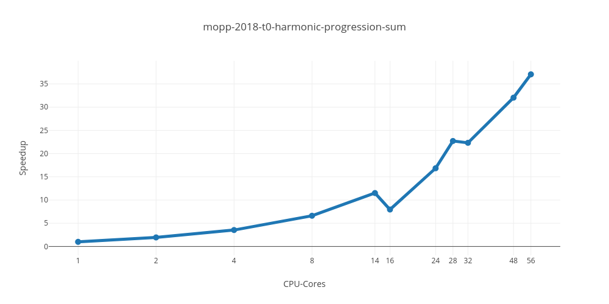
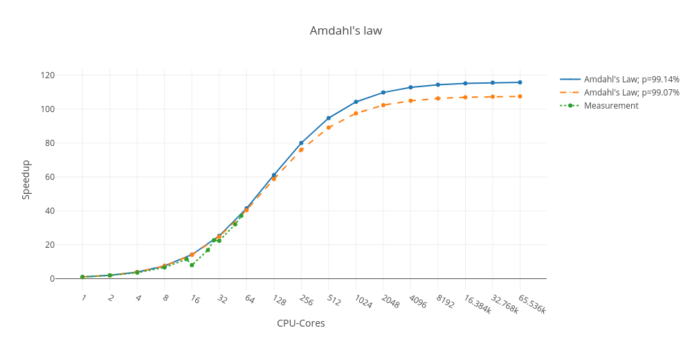

# Lab: CDS Summer 2021

## Task 1: Harmonic Progression Sum

The task was to fix a minor bug in a C code that calculates the harmonic progression sum for a given precision.

### Measurements

**The logs:**

```
program; run; cpus; duration
mopp-2018-t0-harmonic-progression-sum; 1; 1; 210244211
mopp-2018-t0-harmonic-progression-sum; 1; 2; 107913060
mopp-2018-t0-harmonic-progression-sum; 1; 4; 59378629
mopp-2018-t0-harmonic-progression-sum; 1; 8; 31770848
mopp-2018-t0-harmonic-progression-sum; 1; 14; 18272145
mopp-2018-t0-harmonic-progression-sum; 1; 16; 26417411
mopp-2018-t0-harmonic-progression-sum; 1; 24; 12483645
mopp-2018-t0-harmonic-progression-sum; 1; 28; 9256682
mopp-2018-t0-harmonic-progression-sum; 1; 32; 9419721
mopp-2018-t0-harmonic-progression-sum; 1; 48; 6561099
mopp-2018-t0-harmonic-progression-sum; 1; 56; 5672094
```

**Speedup Graph:**



**Amdahl's law with measurements:**



The graph contains the measurements from above as well as two flows of **Amdahl's Law**. The first one is calculated from the speedup **with 28 cores**, the second form the speedup **with 56 cores**.

## Task 2:

### Measurements

## Task 3:

### Measurements